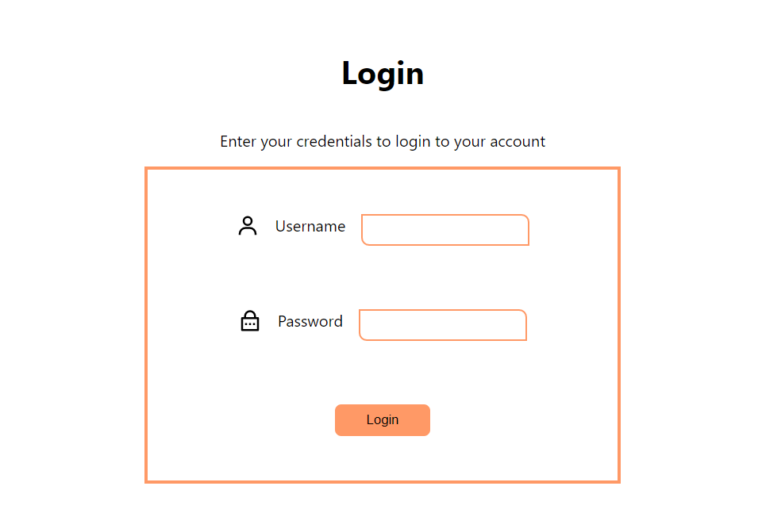
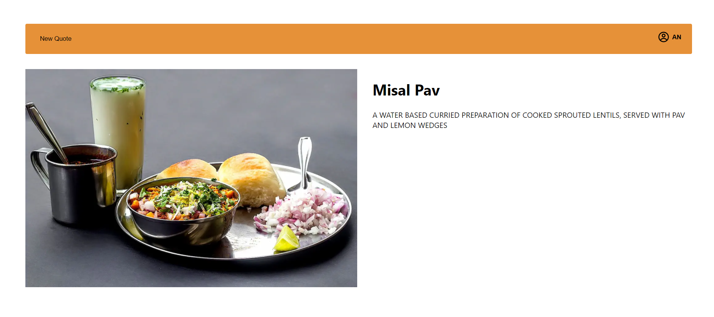
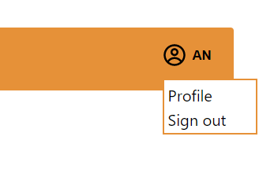
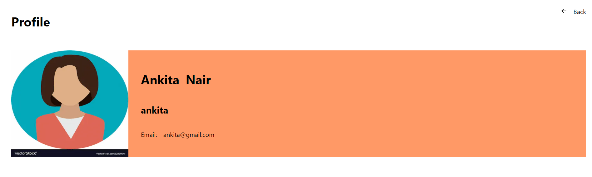

This is basic app, where user can login, check the strapi output, profile and logout.

What is it build using?
* NextJs
* Typescript
* Styled Components - UI
* Strapi - Serverless CMS 
* ExpressJs in Typescript - server
* Zustand - StateManagement

Author: Shreya Tabjul